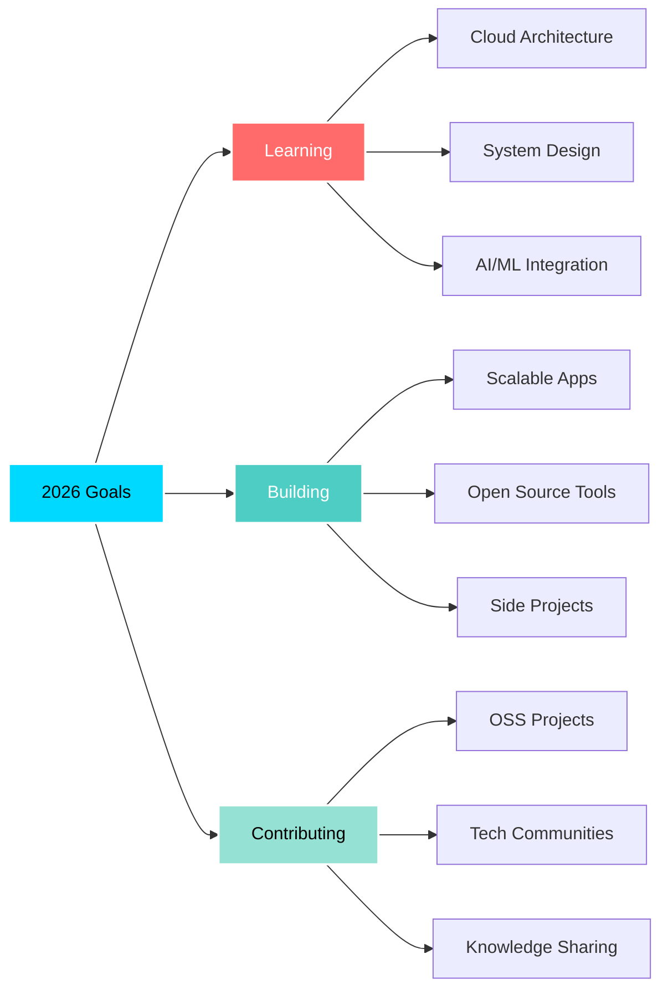

  
#  Hello, I'm OTAI JOSEPH. Commonly known as Josemiles!

---

  
###  *"Code is like humor. When you have to explain it, it's bad."* – Cory House

---

##  About Me

> **Passionate developer** crafting elegant solutions to complex problems. I thrive on building **scalable applications**, exploring **cutting-edge technologies**, and contributing to **open-source communities**. My journey in tech is driven by an insatiable curiosity and a commitment to continuous learning.

-  **Currently Building:** Innovative web applications with modern tech stacks
-  **Learning Journey:** Advanced cloud architecture, microservices, and AI/ML integration
-  **Ask Me About:** Full-stack development, system design, DevOps practices, and code optimization
-  **2026 Goals:** Contribute more to open source & master distributed systems
-  **Fun Fact:** I debug with coffee and solve problems in my sleep!

---

##  Tech Stack & Expertise

###  Languages

###  Frontend Development

###  Backend Development

###  Databases & Storage

###  Cloud & DevOps

###  Testing & Quality

###  Tools & Platforms

###  AI & Machine Learning

---

##  GitHub Statistics

  

---

##  GitHub Trophies

  

---

##  Current Focus

---

##  Professional Experience

-  **Full Stack Development:** Building end-to-end solutions with modern frameworks
-  **UI/UX Implementation:** Crafting responsive and accessible user interfaces
-  **Performance Optimization:** Enhancing application speed and efficiency
-  **Security Best Practices:** Implementing robust authentication and authorization
-  **Scalable Architecture:** Designing systems that grow with business needs
-  **API Development:** Creating RESTful and GraphQL APIs
-  **Cloud Deployment:** Managing infrastructure on AWS, Azure, and GCP
-  **Data Management:** Optimizing database queries and data pipelines

---

##  Featured Projects

| Project                                                                                                                                                                                                                | Description                                            | Tech Stack                           |
| ---------------------------------------------------------------------------------------------------------------------------------------------------------------------------------------------------------------------- | ------------------------------------------------------ | ------------------------------------ |
|  **[Project Alpha](#)**                   | Full-stack e-commerce platform with real-time features | React, Node.js, PostgreSQL, Redis    |
|  **[Project Beta](#)**                     | AI-powered content management system                   | Next.js, Python, TensorFlow, MongoDB |
|  **[Project Gamma](#)**                                 | Microservices architecture for enterprise solutions    | Docker, Kubernetes, Go, gRPC         |
|  **[Project Delta](#)** | Real-time collaboration tool for teams                 | Vue.js, WebSocket, Express, Redis    |

---

##  Let's Connect

---

##  Random Dev Quote

---

##  Contribution Activity

---

###  Thanks for visiting!

**Let's build something amazing together!** 

