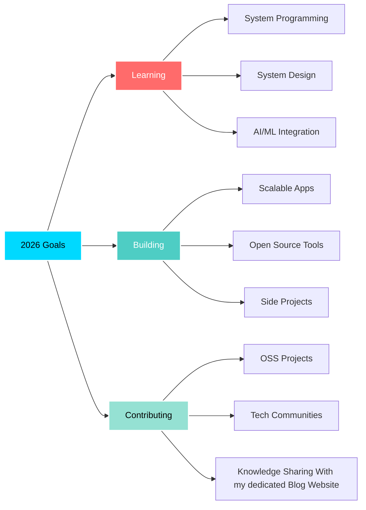

  
# Hi, I am OTAI JOSEPH, An Aspiring Software Engineer 

### *"It is interesting to See what we can do nowadays within the shortest time Possible But it can be a slow poison to someone who does not understand the fundamentals of the work he or she is claiming accountability for.The so called 'simple tasks' are actually the ones that need more creativity because they contribute to more than 90% of the overall project. Therefore, Repeatitive tasks with a set baseline are the ones worth automating but not 'simple tasks'"* – [What I say]

 

## About Me

> **Passionate Software Engineer** crafting elegant solutions to complex problems. I thrive on building **scalable applications**, exploring **cutting-edge technologies**, and contributing to **open-source communities**. My journey in tech is driven by an insatiable curiosity and a commitment to continuous learning.

- **Continuously Learning:** Still on my way to master system programming with low level programming and specifically with C programming language. This so much enjoyable to see stuff work at low level than running abstract commands 
- **Learning Journey:** From the simple basics , How does 1 + 1 become 2, Understanding Operating Systems, Data Structures and Algorithms and many more have shaped how I approach tech Challenges. But I am proud of all the challenges that I have encountered along the way and those due to come.
- **2026 Goals:** Adding System Programming to my muscle memory and more importantly creating a platform to teach other people what I have tried to summarize across the different books I have been reading.
- **Fun Fact:** Music is my companion especially when I want more dopamine. This makes my relation with an IDE inseparable

## Tech Stack & Expertise

### Languages That I Use Everyday

### Languages that I Rarely Use

### Frontend Development

### Backend Development Tools That I Always Use

### Backend Development Tools That I Rarely Use

### Backend Development Tools I am Currently Adding to My toolbox

### Databases & Storage I interact With Everyday

### Databases & Storage I Rarely Interact With

### Cloud, DevOps & IaC Already In My toolBox

### Cloud, DevOps & IaC I am Currently Perfecting On

### Testing & Quality

### Tools & Platforms

### AI & Machine Learning

## GitHub Statistics

<!-- Detailed profile summary (repos, commits, PRs, issues per language) – live data -->

<a href="https://github.com/Josemiles-ctr">
  <!-- utcOffset=3: East Africa Time (UTC+3) -->
  
</a>

## Current Focus

```mermaid
graph LR
    A[2026 Goals] --> B[Learning]
    A --> C[Building]
    A --> D[Contributing]

    B --> B1[System Programming]
    B --> B2[System Design]
    B --> B3[AI/ML Integration]

    C --> C1[Scalable Apps]
    C --> C2[Open Source Tools]
    C --> C3[Side Projects]

    D --> D1[OSS Projects]
    D --> D2[Tech Communities]
    D --> D3[Knowledge Sharing With my dedicated Blog Website]

    style A fill:#00D9FF,stroke:#fff,stroke-width:2px,color:#000
    style B fill:#FF6B6B,stroke:#fff,stroke-width:2px,color:#fff
    style C fill:#4ECDC4,stroke:#fff,stroke-width:2px,color:#fff
    style D fill:#95E1D3,stroke:#fff,stroke-width:2px,color:#000
```

## Professional Experience

- **Full Stack Development:** Building end-to-end solutions with modern frameworks
- **UI/UX Implementation:** Crafting responsive and accessible user interfaces
- **Performance Optimization:** Enhancing application speed and efficiency
- **Security Best Practices:** Implementing robust authentication and authorization
- **Scalable Architecture:** Designing systems that grow with business needs
- **API Development:** Creating RESTful and GraphQL APIs
- **Cloud Deployment:** Managing infrastructure on AWS, Azure, and GCP
- **IaC & Automation:** Provisioning cloud resources with Terraform and Terragrunt
- **Data Management:** Optimizing database queries and data pipelines

## Let's Connect

## Contribution Snake

<picture>
  <source media="(prefers-color-scheme: dark)" srcset="https://raw.githubusercontent.com/Josemiles-ctr/Josemiles-ctr/output/github-contribution-grid-snake-dark.svg">
  <source media="(prefers-color-scheme: light)" srcset="https://raw.githubusercontent.com/Josemiles-ctr/Josemiles-ctr/output/github-contribution-grid-snake.svg">
  
</picture>

### Thanks for visiting!

**Let's build something amazing together!**

